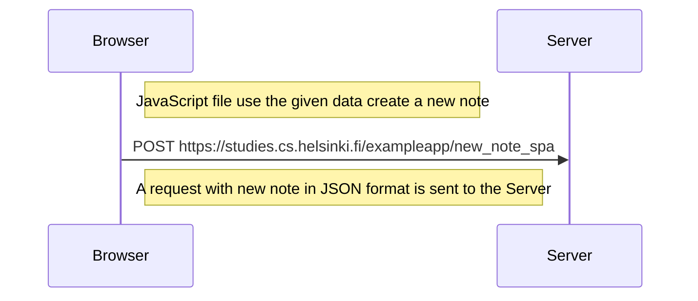

Diagram that represents the creation of a new note in SPA [FullStackOpen - 0.6](https://studies.cs.helsinki.fi/exampleapp/spa)

```mermaid
  sequenceDiagram
    participant Browser
    participant Server

    Note right of Browser: JavaScript file use the given data create a new note
    
    Browser->>Server: POST https://studies.cs.helsinki.fi/exampleapp/new_note_spa

    Note right of Browser: A request with new note in JSON format is sent to the Server  
```