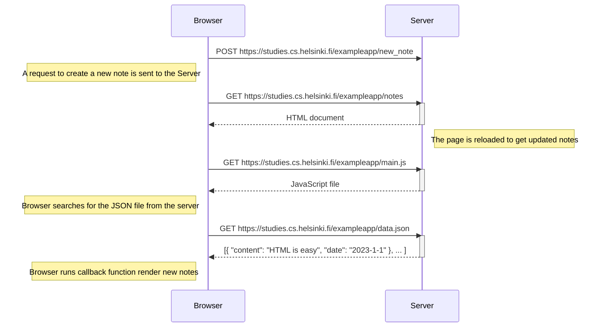

Diagram that represents the creation of a new note in [FullStackOpen - 0.4](https://studies.cs.helsinki.fi/exampleapp/notes)

```mermaid
  sequenceDiagram
      participant Browser
      participant Server
  
      Browser->>Server: POST https://studies.cs.helsinki.fi/exampleapp/new_note
  
      Note left of Browser: A request to create a new note is sent to the Server
  
      Browser->>Server: GET https://studies.cs.helsinki.fi/exampleapp/notes
      activate Server
      Server-->>Browser: HTML document
      deactivate Server
  
      Note right of Server: The page is reloaded to get updated notes
  
      Browser->>Server: GET https://studies.cs.helsinki.fi/exampleapp/main.js
      activate Server
      Server-->>Browser: JavaScript file
      deactivate Server
  
      Note left of Browser: Browser searches for the JSON file from the server
  
      Browser->>Server: GET https://studies.cs.helsinki.fi/exampleapp/data.json
      activate Server
      Server-->>Browser: [{ "content": "HTML is easy", "date": "2023-1-1" }, ... ]
      deactivate Server
  
      Note left of Browser: Browser runs callback function render new notes
```
