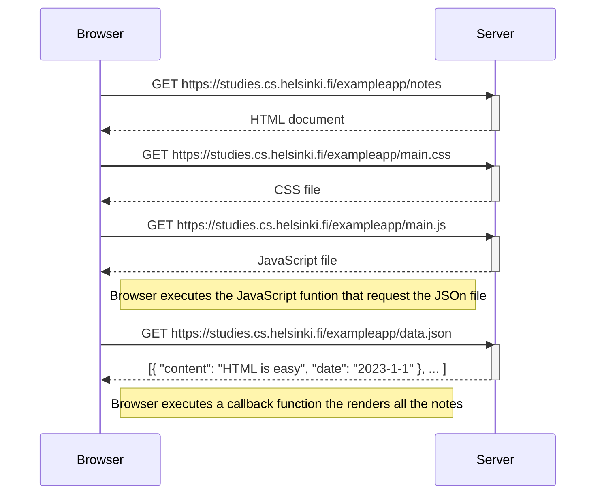

Diagram that represents requests in SPA page [FullStackOpen - 0.5](https://studies.cs.helsinki.fi/exampleapp/spa)

```mermaid
    sequenceDiagram
        participant Browser
        participant Server

        Browser->>Server: GET https://studies.cs.helsinki.fi/exampleapp/notes
        activate Server
        Server-->>Browser: HTML document
        deactivate Server

        Browser->>Server: GET https://studies.cs.helsinki.fi/exampleapp/main.css
        activate Server
        Server-->>Browser: CSS file
        deactivate Server

        Browser->>Server: GET https://studies.cs.helsinki.fi/exampleapp/main.js
        activate Server
        Server-->>Browser: JavaScript file
        deactivate Server

        Note right of Browser: Browser executes the JavaScript funtion that request the JSOn file

        Browser->>Server: GET https://studies.cs.helsinki.fi/exampleapp/data.json
        activate Server
        Server-->>Browser: [{ "content": "HTML is easy", "date": "2023-1-1" }, ... ]
        deactivate Server

        Note right of Browser: Browser executes a callback function the renders all the notes
```